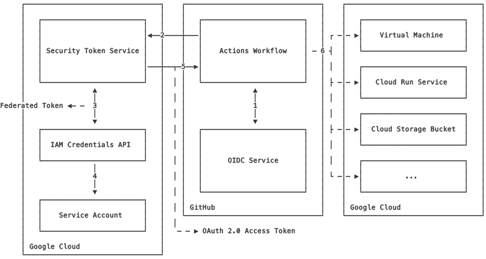
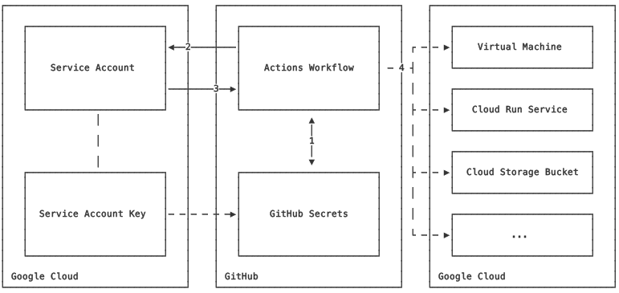

# Authenticate to Google Cloud from GitHub Actions

This GitHub Action authenticates to Google Cloud. It supports authentication via
a Google Cloud Service Account Key JSON and authentication via [Workload
Identity Federation][wif].

Workload Identity Federation is recommended over Service Account Keys as it
obviates the need to export a long-lived credential and establishes a trust
delegation relationship between a particular GitHub Actions workflow invocation
and permissions on Google Cloud. There are three ways to set up this GitHub
Action to authenticate to Google Cloud:

1. [(Preferred) Direct Workload Identity Federation](#direct-wif)
1. [Workload Identity Federation through a Service Account](#indirect-wif)
1. [Service Account Key JSON](#sake)

> [!IMPORTANT]
> The `gsutil` command will **not** use the credentials exported by this GitHub
> Action. Customers should use `gcloud storage` instead.

**This is not an officially supported Google product, and it is not covered by a
Google Cloud support contract. To report bugs or request features in a Google
Cloud product, please contact [Google Cloud
support](https://cloud.google.com/support).**


## Prerequisites

-   This action runs using Node 20. Use a [runner
    version](https://github.com/actions/virtual-environments) that supports this
    version of Node or newer.


## Usage

```yaml
jobs:
  job_id:
    # Any runner supporting Node 20 or newer
    runs-on: ubuntu-latest

    # Add "id-token" with the intended permissions.
    permissions:
      contents: 'read'
      id-token: 'write'

    steps:
    - uses: 'actions/checkout@v4'

    - uses: 'google-github-actions/auth@v2'
      with:
        project_id: 'my-project'
        workload_identity_provider: 'projects/123456789/locations/global/workloadIdentityPools/my-pool/providers/my-provider'
```

> [!NOTE]
>
> Changing the `permissions` block may remove some default permissions. See the
> [permissions documentation][github-perms] for more information.

For more usage options, see the [examples](docs/EXAMPLES.md).


## Inputs

### Inputs: Workload Identity Federation

> [!WARNING]
>
> This option is [not supported by Firebase Admin
> SDK](https://github.com/firebase/firebase-admin-node/issues/1377). Use Service
> Account Key JSON authentication instead.

> [!WARNING]
>
> As of the time of this writing, the GitHub OIDC token expires in 5 minutes,
> which means any derived credentials also expire in 5 minutes.


The following inputs are for _authenticating_ to Google Cloud via Workload
Identity Federation.

-   `workload_identity_provider`: (Required) The full identifier of the Workload
    Identity Provider, including the project number, pool name, and provider
    name. If provided, this must be the full identifier which includes all
    parts:

    ```text
    projects/123456789/locations/global/workloadIdentityPools/my-pool/providers/my-provider
    ```

-   `service_account`: (Optional) Email address or unique identifier of the
    Google Cloud service account for which to impersonate and generate
    credentials. For example:

    ```text
    my-service-account@my-project.iam.gserviceaccount.com
    ```

    Without this input, the GitHub Action will use [Direct Workload Identity
    Federation](#direct-wif). If this input is provided, the GitHub Action will use
    [Workload Identity Federation through a Service Account](#indirect-wif).

-   `audience`: (Optional) The value for the audience (`aud`) parameter in the
    generated GitHub Actions OIDC token. This value defaults to the value of
    `workload_identity_provider`, which is also the default value Google Cloud
    expects for the audience parameter on the token.

### Inputs: Service Account Key JSON

> [!CAUTION]
>
> Service Account Key JSON credentials are long-lived credentials and must be
> treated like a password.

The following inputs are for _authenticating_ to Google Cloud via a Service
Account Key JSON.

-   `credentials_json`: (Required) The Google Cloud Service Account Key JSON to
    use for authentication.

    We advise minifying your JSON into a single line string before storing it in
    a GitHub Secret. When a GitHub Secret is used in a GitHub Actions workflow,
    _each line_ of the secret is masked in log output. This can lead to
    aggressive sanitization of benign characters like curly braces (`{}`) and
    brackets (`[]`).

    To generate access tokens or ID tokens using this service account, you must
    grant the underlying service account `roles/iam.serviceAccountTokenCreator`
    permissions on itself.

### Inputs: Generating OAuth 2.0 access tokens

The following inputs are for _generating_ OAuth 2.0 access tokens for
authenticating to Google Cloud as an output for use in future steps in the
workflow. These options only apply to access tokens generated by this action. By
default, this action does not generate any tokens.

-   `service_account`: (Required) Email address or unique identifier of the
    Google Cloud service account for which to generate the access token. For
    example:

    ```text
    my-service-account@my-project.iam.gserviceaccount.com
    ```

-   `token_format`: (Required) This value must be `"access_token"` to generate
    OAuth 2.0 access tokens.

-   `access_token_lifetime`: (Optional) Desired lifetime duration of the access
    token, in seconds. This must be specified as the number of seconds with a
    trailing "s" (e.g. 30s). The default value is 1 hour (3600s). The maximum
    value is 1 hour, unless the
    `constraints/iam.allowServiceAccountCredentialLifetimeExtension`
    organization policy is enabled, in which case the maximum value is 12 hours.

-   `access_token_scopes`: (Optional) List of OAuth 2.0 access scopes to be
    included in the generated token. This is only valid when "token_format" is
    "access_token". The default value is:

    ```text
    https://www.googleapis.com/auth/cloud-platform
    ```

    This can be specified as a comma-separated or newline-separated list.

-   `access_token_subject`: (Optional) Email address of a user to impersonate
    for [Domain-Wide Delegation][dwd]. Access tokens created for Domain-Wide
    Delegation cannot have a lifetime beyond 1 hour, even if the
    `constraints/iam.allowServiceAccountCredentialLifetimeExtension`
    organization policy is enabled.

    In order to support Domain-Wide Delegation via Workload Identity Federation,
    you must grant the external identity ("principalSet")
    `roles/iam.serviceAccountTokenCreator` in addition to
    `roles/iam.workloadIdentityUser`. The default Workload Identity setup will
    only grant the latter role. If you want to use this GitHub Action with
    Domain-Wide Delegation, you must manually add the "Service Account Token
    Creator" role onto the external identity.

    You will also need to customize the `access_token_scopes` value to
    correspond to the OAuth scopes required for the API(s) you will access.

### Inputs: Generating ID tokens

The following inputs are for _generating_ ID tokens for authenticating to Google
Cloud as an output for use in future steps in the workflow. These options only
apply to ID tokens generated by this action. By default, this action does not
generate any tokens.

> [!CAUTION]
>
> ID Tokens have a maximum lifetime of 10 minutes. This value cannot be changed.

-   `service_account`: (Required) Email address or unique identifier of the
    Google Cloud service account for which to generate the ID token. For
    example:

    ```text
    my-service-account@my-project.iam.gserviceaccount.com
    ```

-   `token_format`: This value must be `"id_token"` to generate ID tokens.

-   `id_token_audience`: (Required) The audience for the generated ID Token.

-   `id_token_include_email`: (Optional) Optional parameter of whether to
    include the service account email in the generated token. If true, the token
    will contain "email" and "email_verified" claims. This is only valid when
    "token_format" is "id_token". The default value is false.

### Inputs: Miscellaneous

The following inputs are for controlling the behavior of this GitHub Actions,
regardless of the authentication mechanism.

-   `project_id`: (Optional) Custom project ID to use for authentication and
    exporting into other steps. If unspecified, we will attempt to extract the
    project ID from the Workload Identity Provider, Service Account email, or
    the Service Account Key JSON. If this fails, you will need to specify the
    project ID manually.

-   `create_credentials_file`: (Optional) If true, the action will securely
    generate a credentials file which can be used for authentication via gcloud
    and Google Cloud SDKs in other steps in the workflow. The default is true.

    The credentials file is exported into the GitHub Actions temp directory,
    outside of the current workspace.

-   `export_environment_variables`: (Optional) If true, the action will export
    common environment variables which are known to be consumed by popular
    downstream libraries and tools, including:

    -   `CLOUDSDK_PROJECT`
    -   `CLOUDSDK_CORE_PROJECT`
    -   `GCP_PROJECT`
    -   `GCLOUD_PROJECT`
    -   `GOOGLE_CLOUD_PROJECT`

    If `create_credentials_file` is true, additional environment variables are
    exported:

    -   `CLOUDSDK_AUTH_CREDENTIAL_FILE_OVERRIDE`
    -   `GOOGLE_APPLICATION_CREDENTIALS`
    -   `GOOGLE_GHA_CREDS_PATH`

    If false, the action will not export any environment variables, meaning
    future steps are unlikely to be automatically authenticated to Google Cloud.
    The default value is true.

-   `delegates`: (Optional) List of additional service account emails or unique
    identities to use for impersonation in the chain. By default there are no
    delegates. This can be specified as a comma-separated or newline-separated
    list.

-   `universe`: (Optional) The Google Cloud universe to use for constructing API
    endpoints. The default universe is "googleapis.com", which corresponds to
    https://cloud.google.com. Trusted Partner Cloud and Google Distributed
    Hosted Cloud should set this to their universe address.

    You can also override individual API endpoints by setting the environment
    variable `GHA_ENDPOINT_OVERRIDE_<endpoint>` where endpoint is the API
    endpoint to override. This only applies to the `auth` action and does not
    persist to other steps. For example:

    ```yaml
    env:
      GHA_ENDPOINT_OVERRIDE_oauth2: 'https://oauth2.myapi.endpoint/v1'
    ```

-   `request_reason`: (Optional) An optional Reason Request [System
    Parameter](https://cloud.google.com/apis/docs/system-parameters) for each
    API call made by the GitHub Action. This will inject the
    "X-Goog-Request-Reason" HTTP header, which will provide user-supplied
    information in Google Cloud audit logs.

-   `cleanup_credentials`: (Optional) If true, the action will remove any
    created credentials from the filesystem upon completion. This only applies
    if "create_credentials_file" is true. The default is true.

## Outputs

-   `project_id`: Provided or extracted value for the Google Cloud project ID.

-   `credentials_file_path`: Path on the local filesystem where the generated
    credentials file resides. This is only available if
    "create_credentials_file" was set to true.

-   `auth_token`: The Google Cloud federated token (for Workload Identity
    Federation) or self-signed JWT (for a Service Account Key JSON). This output
    is always available.

-   `access_token`: The Google Cloud access token for calling other Google Cloud
    APIs. This is only available when "token_format" is "access_token".

-   `id_token`: The Google Cloud ID token. This is only available when
    "token_format" is "id_token".


<a id="setup"></a>
## Setup

This section describes the three configuration options:

1. [(Preferred) Direct Workload Identity Federation](#direct-wif)
1. [Workload Identity Federation through a Service Account](#indirect-wif)
1. [Service Account Key JSON](#sake)

> [!IMPORTANT]
>
> It can take up to 5 minutes for Workload Identity Pools, Workload Identity
> Providers, and IAM permissions to propagate. Please wait at least five minutes
> and follow all [Troubleshooting steps](docs/TROUBLESHOOTING.md) before opening
> an issue.


<a name="direct-wif" id="direct-wif"></a>
### (Preferred) Direct Workload Identity Federation

In this setup, the Workload Identity Pool has direct IAM permissions on Google
Cloud resources; there are no intermediate service accounts or keys. This is
preferred since it directly authenticates GitHub Actions to Google Cloud without
a proxy resource. However, not all Google Cloud resources support `principalSet`
identities, and the resulting token has a maximum lifetime of 10 minutes. Please
see the documentation for your Google Cloud service for more information.

[](docs/google-github-actions-auth-direct-workload-identity-federation.svg)

> [!IMPORTANT]
>
> To generate OAuth 2.0 access tokens or ID tokens, you _must_ provide a service
> account email, and the Workload Identity Pool must have
> `roles/iam.workloadIdentityUser` permissions on the target Google Cloud
> Service Account. Follow the steps for Workload Identity Federation through a
> Service Account instead.

<details>
  <summary>Click here to show detailed instructions for configuring GitHub authentication to Google Cloud via a direct Workload Identity Federation.</summary>

These instructions use the [gcloud][gcloud] command-line tool.

1.  Create a Workload Identity Pool:

    ```sh
    # TODO: replace ${PROJECT_ID} with your value below.

    gcloud iam workload-identity-pools create "github" \
      --project="${PROJECT_ID}" \
      --location="global" \
      --display-name="GitHub Actions Pool"
    ```

1.  Get the full ID of the Workload Identity **Pool**:

    ```sh
    # TODO: replace ${PROJECT_ID} with your value below.

    gcloud iam workload-identity-pools describe "github" \
      --project="${PROJECT_ID}" \
      --location="global" \
      --format="value(name)"
    ```

    This value should be of the format:

    ```text
    projects/123456789/locations/global/workloadIdentityPools/github
    ```

1.  Create a Workload Identity **Provider** in that pool:

    **🛑 CAUTION!** Always add an Attribute Condition to restrict entry into the
    Workload Identity Pool. You can further restrict access in IAM Bindings, but
    always add a basic condition that restricts admission into the pool. A good
    default option is to restrict admission based on your GitHub organization as
    demonstrated below. Please see the [security
    considerations][security-considerations] for more details.

    ```sh
    # TODO: replace ${PROJECT_ID} and ${GITHUB_ORG} with your values below.

    gcloud iam workload-identity-pools providers create-oidc "my-repo" \
      --project="${PROJECT_ID}" \
      --location="global" \
      --workload-identity-pool="github" \
      --display-name="My GitHub repo Provider" \
      --attribute-mapping="google.subject=assertion.sub,attribute.actor=assertion.actor,attribute.repository=assertion.repository,attribute.repository_owner=assertion.repository_owner" \
      --attribute-condition="assertion.repository_owner == '${GITHUB_ORG}'" \
      --issuer-uri="https://token.actions.githubusercontent.com"
    ```

    > **❗️ IMPORTANT** You must map any claims in the incoming token to
    > attributes before you can assert on those attributes in a CEL expression
    > or IAM policy!

1.  Extract the Workload Identity **Provider** resource name:

    ```sh
    # TODO: replace ${PROJECT_ID} with your value below.

    gcloud iam workload-identity-pools providers describe "my-repo" \
      --project="${PROJECT_ID}" \
      --location="global" \
      --workload-identity-pool="github" \
      --format="value(name)"
    ```

    Use this value as the `workload_identity_provider` value in the GitHub
    Actions YAML:

    ```yaml
    - uses: 'google-github-actions/auth@v2'
      with:
        project_id: 'my-project'
        workload_identity_provider: '...' # "projects/123456789/locations/global/workloadIdentityPools/github/providers/my-repo"
    ```

    > **❗️ IMPORTANT** The `project_id` input is optional, but may be required
    > by downstream authentication systems such as the `gcloud` CLI.
    > Unfortunately we cannot extract the project ID from the Workload Identity
    > Provider, since it requires the project _number_.
    >
    > It is technically possible to convert a project _number_ into a project
    > _ID_, but it requires permissions to call Cloud Resource Manager, and we
    > cannot guarantee that the Workload Identity Pool has those permissions.

1.  As needed, allow authentications from the Workload Identity Pool to Google
    Cloud resources. These can be any Google Cloud resources that support
    federated ID tokens, and it can be done after the GitHub Action is
    configured.

    The following example shows granting access from a GitHub Action in a
    specific repository a secret in Google Secret Manager.

    ```sh
    # TODO: replace ${PROJECT_ID}, ${WORKLOAD_IDENTITY_POOL_ID}, and ${REPO}
    # with your values below.
    #
    # ${REPO} is the full repo name including the parent GitHub organization,
    # such as "my-org/my-repo".
    #
    # ${WORKLOAD_IDENTITY_POOL_ID} is the full pool id, such as
    # "projects/123456789/locations/global/workloadIdentityPools/github".

    gcloud secrets add-iam-policy-binding "my-secret" \
      --project="${PROJECT_ID}" \
      --role="roles/secretmanager.secretAccessor" \
      --member="principalSet://iam.googleapis.com/${WORKLOAD_IDENTITY_POOL_ID}/attribute.repository/${REPO}"
    ```

    Review the [GitHub documentation][github-oidc] for a complete list of
    options and values. This GitHub repository does not seek to enumerate every
    possible combination.
</details>


<a name="indirect-wif" id="indirect-wif"></a>
### Workload Identity Federation through a Service Account

In this setup, the Workload Identity Pool impersonates a Google Cloud Service
Account which has IAM permissions on Google Cloud resources. This exchanges the
GitHub Actions OIDC token with a Google Cloud OAuth 2.0 access token by granting
GitHub Actions permissions to mint tokens for the given Service Account. Thus
GitHub Actions inherits that Service Account's permissions by proxy.

[](docs/google-github-actions-auth-workload-identity-federation-through-service-account.svg)

<details>
  <summary>Click here to show detailed instructions for configuring GitHub authentication to Google Cloud via a Workload Identity Federation through a Service Account.</summary>

These instructions use the [gcloud][gcloud] command-line tool.

1.  (Optional) Create a Google Cloud Service Account. If you already have a
    Service Account, take note of the email address and skip this step.

    ```sh
    # TODO: replace ${PROJECT_ID} with your value below.

    gcloud iam service-accounts create "my-service-account" \
      --project "${PROJECT_ID}"
    ```

1.  Create a Workload Identity Pool:

    ```sh
    # TODO: replace ${PROJECT_ID} with your value below.

    gcloud iam workload-identity-pools create "github" \
      --project="${PROJECT_ID}" \
      --location="global" \
      --display-name="GitHub Actions Pool"
    ```

1.  Get the full ID of the Workload Identity **Pool**:

    ```sh
    # TODO: replace ${PROJECT_ID} with your value below.

    gcloud iam workload-identity-pools describe "github" \
      --project="${PROJECT_ID}" \
      --location="global" \
      --format="value(name)"
    ```

    This value should be of the format:

    ```text
    projects/123456789/locations/global/workloadIdentityPools/github
    ```

1.  Create a Workload Identity **Provider** in that pool:

    **🛑 CAUTION!** Always add an Attribute Condition to restrict entry into the
    Workload Identity Pool. You can further restrict access in IAM Bindings, but
    always add a basic condition that restricts admission into the pool. A good
    default option is to restrict admission based on your GitHub organization as
    demonstrated below. Please see the [security
    considerations][security-considerations] for more details.

    ```sh
    # TODO: replace ${PROJECT_ID} and ${GITHUB_ORG} with your values below.

    gcloud iam workload-identity-pools providers create-oidc "my-repo" \
      --project="${PROJECT_ID}" \
      --location="global" \
      --workload-identity-pool="github" \
      --display-name="My GitHub repo Provider" \
      --attribute-mapping="google.subject=assertion.sub,attribute.actor=assertion.actor,attribute.repository=assertion.repository,attribute.repository_owner=assertion.repository_owner" \
      --attribute-condition="assertion.repository_owner == '${GITHUB_ORG}'" \
      --issuer-uri="https://token.actions.githubusercontent.com"
    ```

    > **❗️ IMPORTANT** You must map any claims in the incoming token to
    > attributes before you can assert on those attributes in a CEL expression
    > or IAM policy!

1.  Allow authentications from the Workload Identity Pool to your Google Cloud
    Service Account.

    ```sh
    # TODO: replace ${PROJECT_ID}, ${WORKLOAD_IDENTITY_POOL_ID}, and ${REPO}
    # with your values below.
    #
    # ${REPO} is the full repo name including the parent GitHub organization,
    # such as "my-org/my-repo".
    #
    # ${WORKLOAD_IDENTITY_POOL_ID} is the full pool id, such as
    # "projects/123456789/locations/global/workloadIdentityPools/github".

    gcloud iam service-accounts add-iam-policy-binding "my-service-account@${PROJECT_ID}.iam.gserviceaccount.com" \
      --project="${PROJECT_ID}" \
      --role="roles/iam.workloadIdentityUser" \
      --member="principalSet://iam.googleapis.com/${WORKLOAD_IDENTITY_POOL_ID}/attribute.repository/${REPO}"
    ```

    Review the [GitHub documentation][github-oidc] for a complete list of
    options and values. This GitHub repository does not seek to enumerate every
    possible combination.

1.  Extract the Workload Identity **Provider** resource name:

    ```sh
    # TODO: replace ${PROJECT_ID} with your value below.

    gcloud iam workload-identity-pools providers describe "my-repo" \
      --project="${PROJECT_ID}" \
      --location="global" \
      --workload-identity-pool="github" \
      --format="value(name)"
    ```

    Use this value as the `workload_identity_provider` value in the GitHub
    Actions YAML:

    ```yaml
    - uses: 'google-github-actions/auth@v2'
      with:
        service_account: '...' # my-service-account@my-project.iam.gserviceaccount.com
        workload_identity_provider: '...' # "projects/123456789/locations/global/workloadIdentityPools/github/providers/my-repo"
    ```

1.  As needed, grant the Google Cloud Service Account permissions to access
    Google Cloud resources. This step varies by use case. The following example
    shows granting access to a secret in Google Secret Manager.

    ```sh
    # TODO: replace ${PROJECT_ID} with your value below.

    gcloud secrets add-iam-policy-binding "my-secret" \
      --project="${PROJECT_ID}" \
      --role="roles/secretmanager.secretAccessor" \
      --member="serviceAccount:my-service-account@${PROJECT_ID}.iam.gserviceaccount.com"
    ```
</details>


<a name="sake" id="sake"></a>
### Service Account Key JSON

In this setup, a Service Account has direct IAM permissions on Google Cloud
resources. You download a Service Account Key JSON file and upload it to GitHub
as a secret.

[](docs/google-github-actions-auth-service-account-key-export.svg)

> [!CAUTION]
>
> Google Cloud Service Account Key JSON files must be secured
> and treated like a password. Anyone with access to the JSON key can
> authenticate to Google Cloud as the underlying Service Account. By default,
> these credentials never expire, which is why the former authentication options
> are much preferred.

<details>
  <summary>Click here to show detailed instructions for configuring GitHub authentication to Google Cloud via a Service Account Key JSON.</summary>

These instructions use the [gcloud][gcloud] command-line tool.

1.  (Optional) Create a Google Cloud Service Account. If you already have a
    Service Account, take note of the email address and skip this step.

    ```sh
    # TODO: replace ${PROJECT_ID} with your value below.

    gcloud iam service-accounts create "my-service-account" \
      --project "${PROJECT_ID}"
    ```

1.  Create a Service Account Key JSON for the Service Account.

    ```sh
    # TODO: replace ${PROJECT_ID} with your value below.

    gcloud iam service-accounts keys create "key.json" \
      --iam-account "my-service-account@${PROJECT_ID}.iam.gserviceaccount.com"
    ```

1.  Upload the contents of this file as a [GitHub Actions
    Secret](https://docs.github.com/en/actions/security-guides/using-secrets-in-github-actions).

    Use the name of the GitHub Actions secret as the `credentials_json` value in
    the GitHub Actions YAML:

    ```yaml
    - uses: 'google-github-actions/auth@v2'
      with:
        credentials_json: '${{ secrets.GOOGLE_CREDENTIALS }}' # Replace with the name of your GitHub Actions secret
    ```
</details>

[dwd]: https://developers.google.com/admin-sdk/directory/v1/guides/delegation
[gcloud]: https://cloud.google.com/sdk
[github-oidc]: https://docs.github.com/en/actions/deployment/security-hardening-your-deployments/about-security-hardening-with-openid-connect#understanding-the-oidc-token
[github-perms]: https://docs.github.com/en/actions/learn-github-actions/workflow-syntax-for-github-actions#permissions
[map-external]: https://cloud.google.com/iam/docs/access-resources-oidc#impersonate
[wif]: https://cloud.google.com/iam/docs/workload-identity-federation
[security-considerations]: docs/SECURITY_CONSIDERATIONS.md
